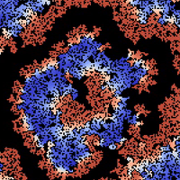
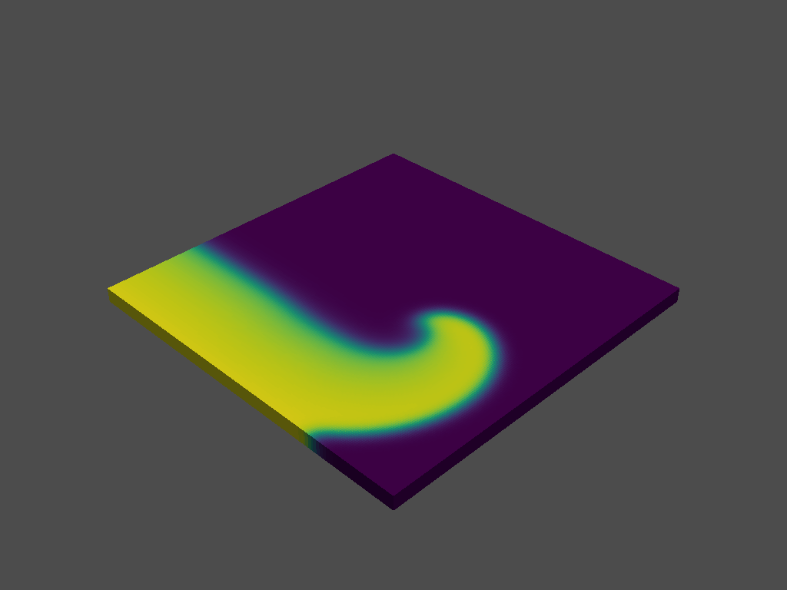
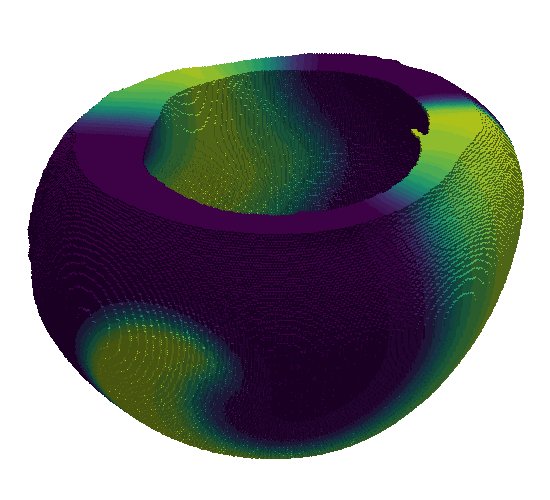

# Finitewave

[](https://github.com/finitewave/Finitewave/blob/main/LICENSE)  [](https://github.com/finitewave/Finitewave/actions/workflows/test.yml)  [](https://codecov.io/gh/finitewave/Finitewave)

Finitewave is a lightweight Python framework for simulating cardiac electrophysiology in 2D and 3D using finite-difference methods.
It is designed to make cardiac modeling accessible from the very first simulation, with a clear and modular structure that supports experimentation, learning, and customization. Its Python foundation allows straightforward integration with other libraries (e.g., NumPy, Matplotlib, SciPy, Jupyter) and makes it ideal for use in educational and research settings.

## Why Finitewave?

1. Simple pipeline: tissue → model → stimulation → run.
2. Explicit control over each simulation step.
3. Lightweight and runnable on standard laptops (no HPC required).
4. Built-in 2D and 3D support.
5. Includes a built-in library of phenomenological and ionic models.
6. Fully Python-based (easy integration with NumPy/Pandas workflows).
7. Designed for extensibility — suitable as a base for custom research workflows and model development.

If you are a student, researcher or engineer - you can easily get started with Finitewave using the **Quick start** below or by starting with **examples** and **Tutorials** folders.

## Typical use cases

1. Planar wave simulations.
2. Spiral wave dynamics.
3. High-pacing protocols.
4. Fibrosis-induced propagation effects.
5. Educational demonstrations of cardiac models or reaction-diffusion systems.

<p align="center">
  
  
  
</p>

---

# Installation

To install Finitewave, run:

```bash
pip install finitewave
```

This will install Finitewave as a Python package on your system.

## Other installation options

You can also do it from source - navigate to the root directory of the project and run:

```bash
python -m build
pip install dist/finitewave-<version>.whl
```

For development purposes, install in editable mode (changes apply immediately without reinstall):

```bash
pip install -e .
```

---

# Requirements

Finitewave requires the following minimal versions:

| Dependency      | Version* | Link |
|----------------|----------|------|
| ffmpeg-python  | 0.2.0    | https://pypi.org/project/ffmpeg-python/ |
| matplotlib     | 3.9.2    | https://pypi.org/project/matplotlib/ |
| natsort        | 8.4.0    | https://pypi.org/project/natsort/ |
| numba          | 0.60.0   | https://pypi.org/project/numba/ |
| numpy          | 1.26.4   | https://pypi.org/project/numpy/ |
| pandas         | 2.2.3    | https://pypi.org/project/pandas/ |
| pyvista        | 0.44.1   | https://pypi.org/project/pyvista/ |
| scikit-image   | 0.24.0   | https://pypi.org/project/scikit-image/ |
| scipy          | 1.14.1   | https://pypi.org/project/scipy/ |
| tqdm           | 4.66.5   | https://pypi.org/project/tqdm/ |

\* minimal version

---

# Quick start

This quick start guide will walk you through the basic steps of setting up a simple cardiac simulation using Finitewave. What we will do:

1. Create a 2D cardiac tissue.
2. Set up an electrophysiological model. 
3. Apply stimulation.
4. Run the simulation.
5. Visualize activation time.

Here is the code for this pipeline:

```python
import numpy as np
import matplotlib.pyplot as plt
import finitewave as fw

# set up the tissue:
n = 100
tissue = fw.CardiacTissue([n, n])

# set up the stimulation:
stim_sequence = fw.StimSequence()
stim_sequence.add_stim(
    fw.StimVoltageCoord(
        time=0,
        volt_value=1,
        x1=1, x2=n-1, y1=1, y2=3
    )
)

# set up the tracker:
act_time_tracker = fw.ActivationTimeTracker()
act_time_tracker.threshold = 0.5
act_time_tracker.step = 100

tracker_sequence = fw.TrackerSequence()
tracker_sequence.add_tracker(act_time_tracker)

# set up the model
aliev_panfilov = fw.AlievPanfilov()
aliev_panfilov.dt = 0.01
aliev_panfilov.dr = 0.25
aliev_panfilov.t_max = 10

# set up pipeline
aliev_panfilov.cardiac_tissue = tissue
aliev_panfilov.stim_sequence = stim_sequence
aliev_panfilov.tracker_sequence = tracker_sequence

# run model
aliev_panfilov.run()

# show output
fig, axs = plt.subplots(ncols=2)
axs[0].imshow(aliev_panfilov.u, cmap='coolwarm')
axs[0].set_title("u")

axs[1].imshow(act_time_tracker.output, cmap='viridis')
axs[1].set_title("Activation time")

fig.suptitle("Aliev-Panfilov 2D isotropic")
plt.tight_layout()
plt.show()
```

Now, let's move on to a detailed explanation. 

## Table of Contents

- [Cardiac Tissue](#cardiac-tissue)
  - [Mesh](#mesh)
  - [Conductivity](#conductivity)
  - [Fibers](#fibers)
- [Cardiac Models](#cardiac-models)
  - [Available models](#available-models)
- [Stimulations](#stimulations)
  - [Voltage Stimulation](#voltage-stimulation)
  - [Current Stimulation](#current-stimulation)
  - [Stimulation Matrix](#stimulation-matrix)
  - [Stimulation Sequence](#stimulation-sequence)
- [Trackers](#trackers)
  - [Tracker Parameters](#tracker-parameters)
  - [Multiple Trackers](#multiple-trackers)
- [Building pipeline](#building-pipeline)
  - [Run the simulation](#run-the-simulation)

---

## Cardiac Tissue

The `CardiacTissue` class is used to represent myocardial tissue and its structural properties in simulations. It includes several key attributes that define the characteristics and behavior of the cardiac mesh used in finite-difference calculations.

First, import the necessary libraries:

```python
import finitewave as fw
import numpy as np
import matplotlib.pyplot as plt
```

Initialize a 100x100 mesh with all nodes set to 1 (healthy cardiac tissue). Add empty nodes (0) at the mesh edges to simulate boundaries.

```python
n = 100
tissue = fw.CardiacTissue([n, n])
```

### Mesh

The `mesh` attribute is a mesh consisting of nodes, which represent the myocardial medium. The distance between neighboring nodes is defined by the spatial step (`dr`) parameter of the model. The nodes in the mesh are used to represent different types of tissue and their properties:

- `0`: Empty node, representing the absence of cardiac tissue.
- `1`: Healthy cardiac tissue, which supports wave propagation.
- `2`: Fibrotic or infarcted tissue, representing damaged or non-conductive areas.

Nodes marked as `0` and `2` are treated similarly as isolated nodes with no flux through their boundaries. These different notations help distinguish between areas of healthy tissue, empty spaces, and regions of fibrosis or infarction.

> **Note**  
> To satisfy boundary conditions, every simulation mesh must include boundary nodes (marked as `0`). Finitewave does this automatically and you don't need to do anything unless you're going to set borders yourself.

You can also utilize `0` nodes to define complex geometries and pathways, or to model organ-level structures. For example, to simulate the electrophysiological activity of the heart, you can create a 3D array where `1` represents cardiac tissue, and `0` represents everything outside of that geometry.

---

## Cardiac Models

Each model represents the cardiac electrophysiological activity of a single cell, which can be combined using parabolic equations to form complex 2D or 3D cardiac tissue models.

```python
# Set up Aliev-Panfilov model to perform simulations
aliev_panfilov = fw.AlievPanfilov()
aliev_panfilov.dt = 0.01                # time step
aliev_panfilov.dr = 0.25                # space step
aliev_panfilov.t_max = 10               # simulation time
```

We use an explicit finite-difference scheme, which requires maintaining an appropriate `dt/dr` ratio. For phenomenological models, the recommended calculation parameters for time and space steps are `dt = 0.01` and `dr = 0.25`. You can increase `dt` to `0.02` to speed up calculations, but always verify the stability of your numerical scheme, as instability will lead to incorrect simulation results.

### Available models

| Model                      | Description |
|----------------------------|-------------|
| Aliev-Panfilov             | A phenomenological two-variable model.  <br> [Model Link](https://github.com/finitewave/Aliev-Panfilov-finitewave-model) | 
| Barkley                    | A simple reaction-diffusion model.  <br> [Model Link](https://github.com/finitewave/Barkley-finitewave-model) |
| Mitchell-Schaeffer         | A phenomenological two-variable model. <br> [Model Link](https://github.com/finitewave/Mitchell-Schaeffer-finitewave-model) |
| Fenton-Karma               | A phenomenological three-variables model. <br> [Model Link] (https://github.com/finitewave/Fenton-Karma-finitewave-model) |
| Bueno-Orovio               | A minimalistic ventricular model. <br> [Model Link](https://github.com/finitewave/Bueno-Orovio-finitewave-model) |
| Luo-Rudy 1991              | An ionic ventricular guinea pig model. <br> [Model Link](https://github.com/finitewave/Luo-Rudy-91-finitewave-model) |
| ten Tusscher-Panfilov 2006 | An ionic ventricular human model. <br> [Model Link](https://github.com/finitewave/ten-Tusscher-Panfilov-2006-finitewave-model) |
| Courtemanche               | An ionic atrial human model. <br> [Model Link](https://github.com/finitewave/Courtemanche-finitewave-model) |

---

## Stimulations

To simulate the electrical activity of the heart, you need to apply a stimulus to the tissue. This can be done by setting the voltage or current at specific nodes in the mesh. `StimVoltage` class directly sets voltage values at nodes within the stimulation area.

```python
stim_voltage = fw.StimVoltageCoord(
    time=0,
    volt_value=1,
    x1=1, x2=n-1, y1=1, y2=3
)
```

> **Note**  
> A very small stimulation area may lead to unsuccessful stimulation due to a source-sink mismatch.

### Stimulation Sequence

The `CardiacModel` class uses the `StimSequence` class to manage the stimulation sequence.

```python
stim_sequence = fw.StimSequence()

for i in range(0, 100, 10):
    stim_sequence.add_stim(
        fw.StimVoltageCoord(
            time=i,
            volt_value=1,
            x1=1, x2=n-1, y1=1, y2=3
        )
    )
```

This class also allows you to add multiple stimulations to the model, which can be useful for simulating complex stimulation protocols (e.g., a high-pacing protocol).

```python
# Example: make stimulus every 10-th time unit.
for i in range(0, 100, 10):
    stim_sequence.add_stim(
        fw.StimVoltageCoord(
            time=i,
            volt_value=1,
            x1=1, x2=n-1, y1=1, y2=3
        )
    )
```

---

## Trackers

Trackers are used to record the state of the model during the simulation. They can be used to monitor the wavefront propagation, visualize the activation times, or analyze the wavefront dynamics. Full details on how to use trackers can be found in the examples.

```python
# set up activation time tracker:
act_time_tracker = fw.ActivationTimeTracker()
act_time_tracker.threshold = 0.5
act_time_tracker.step = 100  # calculate activation time every 100 steps
```

### Tracker Parameters

Trackers have several parameters that can be adjusted to customize their behavior:

- `start_time`: The time at which the tracker starts recording data.
- `end_time`: The time at which the tracker stops recording data.
- `step`: The number of steps between each data recording.

> **Note**  
> The `step` parameter is used to control the *frequency* of data recording (should be `int`). But the `start_time` and `end_time` parameters are used to specify the *time* interval during which the tracker will record data.

The `output` property of the tracker class returns the formatted data recorded during the simulation. This data can be used for further analysis or visualization.

Each tracker has its own set of parameters that can be adjusted to customize its behavior. For example, the `ActivationTimeTracker` class has a `threshold` parameter that defines the activation threshold for the nodes. Check out the examples to see each tracker in action.

### Multiple Trackers

The `CardiacModel` class uses the `TrackerSequence` class to manage the trackers. This class allows you to add multiple trackers to the model to monitor different aspects of the simulation. For example, you can track the activation time for all nodes, and the action potential for a specific node.

```python
# set up first activation time tracker:
act_time_tracker = fw.ActivationTimeTracker()
act_time_tracker.threshold = 0.5
act_time_tracker.step = 100  # calculate activation time every 100 steps

# set up action potential tracker for a specific node:
action_pot_tracker = fw.ActionPotentialTracker()
action_pot_tracker.cell_ind = [30, 30]

tracker_sequence = fw.TrackerSequence()
tracker_sequence.add_tracker(act_time_tracker)
tracker_sequence.add_tracker(action_pot_tracker)
```

---

## Building pipeline

Now that we have all the necessary components, we can build the simulation pipeline by setting the tissue, model, stimulations, and trackers.

```python
aliev_panfilov.cardiac_tissue = tissue
aliev_panfilov.stim_sequence = stim_sequence
aliev_panfilov.tracker_sequence = tracker_sequence
```

Finitewave contains other functionalities that can be used to customize the simulation pipeline, such as loading and saving model states or adding custom commands to the simulation loop. For more information, refer to the examples.

### Run the simulation

Finally, we can run the simulation by calling the `run()` method of the `AlievPanfilov` model.

```python
aliev_panfilov.run()

plt.imshow(aliev_panfilov.u, cmap='coolwarm')
plt.show()
```

---

## Other commonly used tissue properties

### Conductivity

The conductivity attribute defines the local conductivity of the tissue and is represented as an array of coefficients ranging from `0.0` to `1.0` for each node in the mesh. It proportionally decreases the diffusion coefficient locally, thereby slowing down the wave propagation in specific areas defined by the user. This is useful for modeling heterogeneous tissue properties, such as regions of impaired conduction due to ischemia or fibrosis.

```python
# Example: set conductivity to 0.5 in the middle of the mesh
tissue.conductivity = np.ones([n, n])
tissue.conductivity[n//4: 3 * n//4, n//4: 3 * n//4] = 0.5
```

### Fibers

Another important attribute, `fibers`, is used to define the anisotropic properties of cardiac tissue. This attribute is represented as a 3D array (for 2D tissue) or a 4D array (for 3D tissue), with each node containing a 2D or 3D vector that specifies the fiber orientation at that specific position. The anisotropic properties of cardiac tissue mean that the wave propagation speed varies depending on the fiber orientation.

```python
# Fibers orientated along the x-axis
tissue.fibers = np.zeros([n, n, 2])
tissue.fibers[:, :, 0] = 1
tissue.fibers[:, :, 1] = 0
```